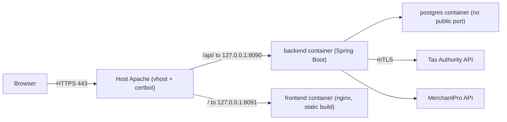

# eFiscal - QA VPS Deployment Runbook

The QA stack runs in Docker Compose and sits behind the VPS's host Apache, which terminates HTTPS with a Let's Encrypt certificate. Code is pulled from GitHub and the images are built on the server.



| Item | Value |
|---|---|
| Repo root on server | `/opt/elef` |
| Secrets | `/opt/elef/.env` (never committed, `chmod 600`) |
| Compose file | `docker-compose.qa.yml` (project name `efiscal-qa`) |
| DB volume | `efiscal-qa_efiscal_pg_qa` |
| Backups | `/var/backups/elef` |
| Apache vhost | `deploy/apache/efiscal-qa.conf` |

Files involved: `docker-compose.qa.yml`, `frontend/Dockerfile.prod`, `frontend/nginx.conf`, `.env.qa.example`, `deploy/qa-deploy.sh`, `deploy/qa-backup.sh`, `deploy/apache/efiscal-qa.conf`.

## Good to know

- The Tax Authority PKCS12 client certificate is stored in the database (API connection settings), so no certificate files are needed on the server.
- Sessions are held in backend memory. Every redeploy or backend restart logs all users out.
- On startup the backend seeds `admin@efiscal.local / Admin123!`, `ops@acme.rs / Ops123!` and the demo "Acme" client/orgs if they are missing. Change these passwords right after the first start (step 7).
- Flyway runs all migrations automatically when the backend starts.

## 0. Before deploying (local machine)

1. Commit and push your work, then merge it into the branch QA deploys (`DEPLOY_BRANCH` in `.env`, default `main`).
2. Run the checks. The Docker image build skips tests.
   ```bash
   cd backend && mvn test
   cd ../frontend && npm run lint && npm run build
   ```

## 1. DNS

Create an A record for the QA host (e.g. `qa.efiscal.<domain>`) pointing to the VPS public IP. Wait until `dig +short qa.efiscal.<domain>` returns that IP.

## 2. Server prep (once)

The server already has Docker and Apache and is shared with other apps:

| Port | Used by |
|---|---|
| 80 / 443 | host Apache (name-based vhosts; eFiscal adds one) |
| 81, 8000, 5433 | `kliklak_dashboard` Docker containers |
| 8080 | a host Java process (not Docker) |
| 127.0.0.1:8090 / 8091 | eFiscal backend / frontend (`EFISCAL_BACKEND_PORT` / `EFISCAL_FRONTEND_PORT` in `.env`) |

```bash
docker compose version                  # must be Compose v2
sudo ss -tlnp | grep -E ':(8090|8091)\b' # must print nothing; if busy, pick other ports in .env AND the Apache vhost

sudo a2enmod proxy proxy_http headers ssl rewrite
sudo apt update && sudo apt install -y certbot python3-certbot-apache git
```

Firewall: check first with `sudo ufw status`. If ufw is currently inactive, enabling it will block every port that is not explicitly allowed **and not published by Docker**. Docker-published ports (81, 8000, 5433) bypass ufw and stay reachable. The host Java process on `8080` does **not** bypass ufw. Find out what it is (`ps -fp $(sudo ss -tlnpH 'sport = :8080' | sed -n 's/.*pid=\([0-9]*\).*/\1/p')`). If it must stay reachable from outside, allow it before enabling ufw:

```bash
sudo ufw allow OpenSSH
sudo ufw allow 'Apache Full'
# sudo ufw allow 8080/tcp               # only if the host Java app must be reachable from outside
sudo ufw enable

sudo mkdir -p /opt/elef /var/backups/elef
sudo chown $USER /opt/elef /var/backups/elef   # /opt/elef must stay empty until the clone
```

Your user must be able to run Docker (`sudo usermod -aG docker $USER`, then log out and back in).

## 3. Get the code (once)

If the GitHub repo is private, add a read-only deploy key:

```bash
ssh-keygen -t ed25519 -f ~/.ssh/efiscal_deploy -N ""
cat ~/.ssh/efiscal_deploy.pub     # GitHub -> darecare/efiscal -> Settings -> Deploy keys -> Add (read-only)

cat >> ~/.ssh/config <<'EOF'
Host github-efiscal
  HostName github.com
  User git
  IdentityFile ~/.ssh/efiscal_deploy
  IdentitiesOnly yes
EOF
chmod 600 ~/.ssh/config
```

Clone directly into `/opt/elef`. The repo root becomes `/opt/elef`, with no nested `efiscal/` folder.

```bash
git clone git@github-efiscal:darecare/efiscal.git /opt/elef
# public repo / default SSH key: git clone git@github.com:darecare/efiscal.git /opt/elef
cd /opt/elef
```

## 4. Secrets (once)

```bash
cd /opt/elef
cp .env.qa.example .env
chmod 600 .env
nano .env
```

- `POSTGRES_PASSWORD`: generate one with `openssl rand -base64 32 | tr -d '/+='`. The backend datasource credentials are derived from `POSTGRES_*` in `docker-compose.qa.yml`.
- `APP_SERIAL_NUMBER`, `APP_ESIR_NUMBER`, `APP_SOFTWARE_VERSION`: values for this QA installation.
- `DEPLOY_BRANCH`: the branch to deploy.

The DB password is applied only when the Postgres volume is first created. Changing it later requires `ALTER USER` inside Postgres.

## 5. First start

```bash
cd /opt/elef
bash deploy/qa-deploy.sh
```

The script pulls `DEPLOY_BRANCH`, builds the images, starts the containers, waits until the backend answers, and prints `docker compose ps`. Check that the migrations went through:

```bash
docker compose -f docker-compose.qa.yml logs backend | grep -Ei 'flyway|migrat|Started'
curl -s -o /dev/null -w '%{http_code}\n' http://127.0.0.1:8091/   # 200
```

## 6. Apache + HTTPS

```bash
cd /opt/elef
sudo cp deploy/apache/efiscal-qa.conf /etc/apache2/sites-available/efiscal-qa.conf
sudo sed -i 's/qa.efiscal.example.com/qa.efiscal.<domain>/g' /etc/apache2/sites-available/efiscal-qa.conf
sudo mkdir -p /var/www/html/.well-known/acme-challenge
sudo a2ensite efiscal-qa
sudo apachectl configtest && sudo systemctl reload apache2

sudo certbot --apache --redirect -d qa.efiscal.<domain>
sudo systemctl list-timers | grep certbot    # auto-renewal timer is present
```

certbot creates `/etc/apache2/sites-available/efiscal-qa-le-ssl.conf` (port 443, a copy of the proxy rules) and changes the port-80 vhost into a redirect. If you later change proxy rules, edit the `-le-ssl.conf` file as well.

Open `https://qa.efiscal.<domain>`. The login page should load.

## 7. Post-deploy configuration (in the app)

1. Log in as `admin@efiscal.local` and **change the password immediately**. Change the password of `ops@acme.rs` or deactivate it.
2. Create the real QA client and organization(s). Deactivate or ignore the seeded "Acme" orgs.
3. Configure per organization:
   - API connections: MerchantPro credentials; Tax Authority **sandbox** URL plus PKCS12 certificate and password
   - SMTP settings (Email tab)
   - Tax and tax category mappings, payment type mappings
   - A manual product marked "Usluga isporuke" if "Uključite trošak isporuke" is enabled
   - Users with cashier names and org access

## 8. Smoke test

- Login/logout, language switch en/sr
- Orders: fetch from MerchantPro, issue a fiscal bill (also one with shipping)
- Products: pull from shop. The progress bar must update live (SSE through Apache).
- Manual fiscal bill against the TA sandbox, then retry, copy and refund flows
- PDF A4 and roll80, email sending

## 9. Backups

```bash
bash /opt/elef/deploy/qa-backup.sh        # test once
ls -lh /var/backups/elef

crontab -e
# daily at 02:00, keeps the newest 14 dumps
0 2 * * * cd /opt/elef && bash deploy/qa-backup.sh >> /var/backups/elef/backup.log 2>&1
```

## Redeploy (every new version)

```bash
cd /opt/elef
bash deploy/qa-deploy.sh
```

Users have to log in again afterwards.

## Rollback

```bash
cd /opt/elef
bash deploy/qa-backup.sh                  # safety dump first
bash deploy/qa-deploy.sh <commit-sha-or-tag>
```

This checks out the given ref (detached) without pulling. Run `bash deploy/qa-deploy.sh` with no argument to go back to `DEPLOY_BRANCH`. Flyway migrations are forward-only. If the version you are rolling back from added migrations, restore the database from a backup taken before that deploy:

```bash
cd /opt/elef
set -a; . ./.env; set +a
docker compose -f docker-compose.qa.yml stop backend
docker compose -f docker-compose.qa.yml exec -T postgres psql -U "$POSTGRES_USER" -d postgres \
  -c "DROP DATABASE \"$POSTGRES_DB\";" -c "CREATE DATABASE \"$POSTGRES_DB\" OWNER \"$POSTGRES_USER\";"
gunzip -c /var/backups/elef/efiscal-YYYY-MM-DD-HHMM.sql.gz | \
  docker compose -f docker-compose.qa.yml exec -T postgres psql -U "$POSTGRES_USER" -d "$POSTGRES_DB"
docker compose -f docker-compose.qa.yml start backend
```

## Troubleshooting

| Symptom | Check |
|---|---|
| Deploy script times out waiting for backend | `docker compose -f docker-compose.qa.yml logs --tail=200 backend` (DB credentials, Flyway errors) |
| 502/503 from Apache | `docker compose -f docker-compose.qa.yml ps`; `curl -I http://127.0.0.1:8091/`; `sudo tail -f /var/log/apache2/efiscal-qa-error.log` |
| Product sync progress only appears at the end | SSE is being buffered: make sure `flushpackets=on` and the `no-gzip` `SetEnvIf` are in the `-le-ssl.conf` vhost too |
| Page refresh on a deep link gives 404 | The frontend nginx SPA fallback is missing; rebuild the frontend image |
| `permission denied` on Docker | Add your user to the `docker` group and log in again |
| `git pull --ff-only` fails | Local edits on the server: `git status`; never edit tracked files on the server |
